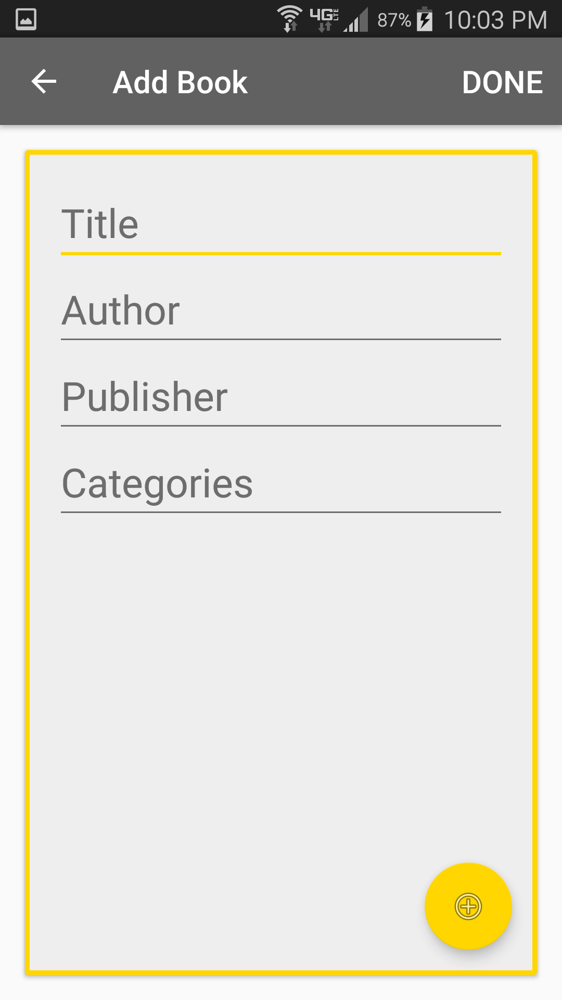
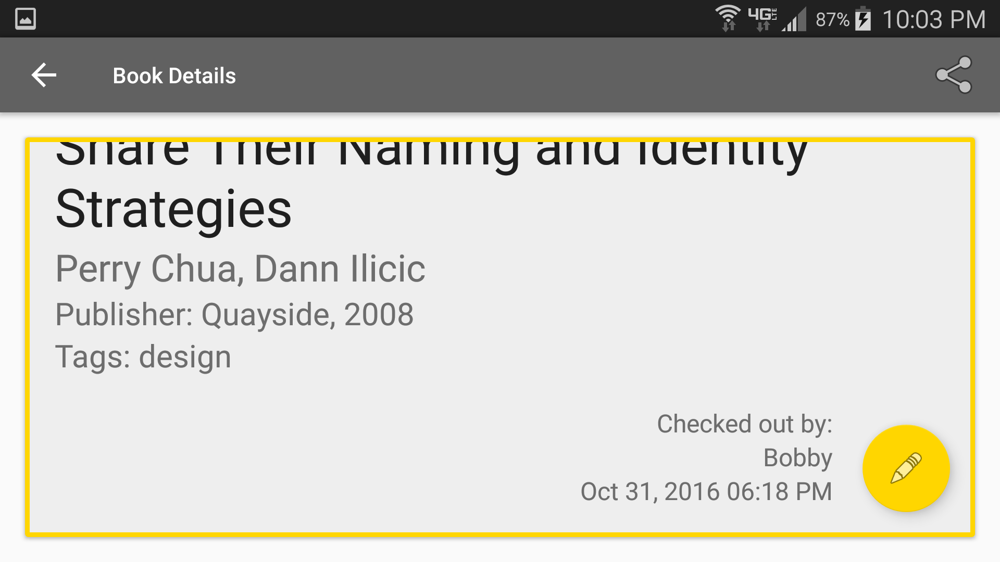

# Prolific-Project
##Prolific Library
###Overview:
Prolific app built based on <a href="http://prolific-interview.herokuapp.com/58124ddb99c50800092e1765/">this wireframe</a>.

###Requirements:
- Performs `GET`, `POST`, `PUT`, and `DELETE` via Retrofit.
- Calls allow user to display, add, manipulate and delete book data on app.
- Can share book data.
- Supports Android 4+

###Libraries used:
- <a href = "https://square.github.io/retrofit/">Retrofit</a>
- <a href = "https://realm.io/">realm.io</a>
- <a href = "http://jakewharton.github.io/butterknife/">Butter Knife</a>

###Bonus:
- <a href = "https://realm.io/">realm.io</a> mobile database allows for offline mode viewing of the library.
- Added <a href = "https://guides.codepath.com/android/Shared-Element-Activity-Transition">Shared Element Activity Transitions</a>.
  
###Screenshots:
 
 
 
 

 
###Video:
[YouTube](https://youtu.be/VIsf3mzV81c)
